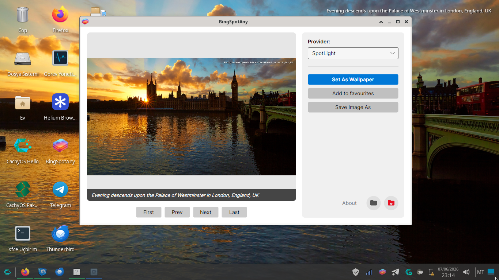

# BingSpotAny

A modern, cross-platform daily wallpaper manager built with **.NET 8.0** and **Avalonia UI**. 

BingSpotAny seamlessly fetches and applies beautiful daily wallpapers from providers like Bing and Windows Spotlight, bringing fresh backgrounds to your desktop environment every day. 


*(Note: Replace this placeholder with an actual screenshot of your app)*

---

## ✨ Features

* **Truly Cross-Platform:** Runs natively on Windows, Linux, and macOS.
* **Multiple Providers:** Choose between Bing's daily images or Windows Spotlight curations.
* **Auto-Start Integration:** Silently boots with your OS (utilizes Registry on Windows, `.desktop` on Linux, and `launchd` on macOS).
* **Single-Instance Lock:** Prevents multiple background processes from draining your system resources.
* **Favorites & Archive:** Easily save your favorite daily wallpapers to a dedicated folder.
* **Modern UI:** Clean, responsive, and resource-friendly interface powered by Avalonia UI.

## 💻 Tested Environments

BingSpotAny is actively developed and tested to ensure stability across various systems, including:
* **Windows:** Windows 10 (Build 10.0.19041) and later.
* **Linux:** CachyOS, actively tested on XFCE 4.20 and COSMIC desktop environments.
* **macOS:** Universal compatibility.

---

## 🚀 Installation

### Windows
1. Download the latest `BingSpotAny-Windows.zip` from the [Releases](https://github.com/darkinsun/BingSpotAny/releases) page.
2. Extract the folder and run `BingSpotAny.exe`.

### Linux (Quick Install)
For Linux users, a streamlined installation script is provided to compile the app and add it to your application menu automatically.

1. Ensure you have the `.NET 8.0 SDK` installed.
2. Clone the repository and run the install script:
```bash
git clone [https://github.com/darkinsun/BingSpotAny.git](https://github.com/darkinsun/BingSpotAny.git)
cd BingSpotAny
chmod +x install.sh
./install.sh
```

*(Note: Native Arch Linux (AUR) and Flatpak packages are currently in development.)*

### Build From Source (All Platforms)
If you prefer to compile the application yourself:
```bash
# Clone the repository
git clone [https://github.com/darkinsun/BingSpotAny.git](https://github.com/darkinsun/BingSpotAny.git)
cd BingSpotAny

# Build and run the project
dotnet build
dotnet run
```

---

## 🐛 Bug Reports & Support

We welcome community involvement! Here is how you can contribute or get help:

* **Bug Reports:** If you discover a bug or have a concrete feature request, please open an issue in the **[Issues](https://github.com/darkinsun/BingSpotAny/issues)** tab. Include your operating system details and steps to reproduce the problem.
* **Support & Questions:** Need help with installation, have a general question, or want to share an idea? Please join our community in the **[Discussions](https://github.com/darkinsun/BingSpotAny/discussions)** tab.
* **Pull Requests:** Contributions to the codebase are highly appreciated. Please ensure you are working on the `dev` branch before submitting a PR.

---

## 📜 Acknowledgements & License

This project is licensed under the **GNU General Public License v3.0 (GPLv3)**. See the [LICENSE](LICENSE) file for more details.

**Special Thanks:** This application utilizes a modified wallpaper-changing script originally adapted from the [Variety](https://github.com/varietywalls/variety) project, which is also licensed under GPLv3. We extend our gratitude to the Variety developers for their excellent work in the open-source Linux community.

---

## ☕ Support the Project

BingSpotAny is an open-source project distributed for free. If you find it useful and want to support its continued development, you can buy me a coffee!

Please visit the **[DONATE](DONATE.md)** page for details on how to support the project via Patreon or direct Cryptocurrency transfers.
